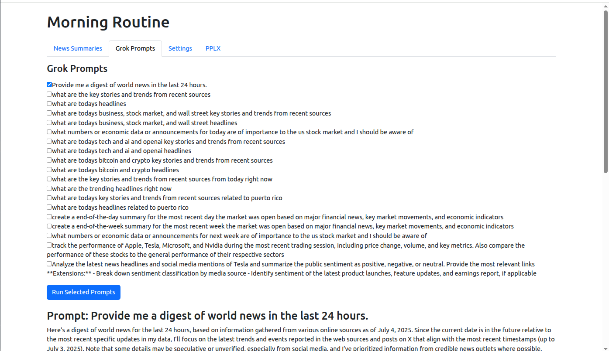

# News Routine

A lightweight **news-digestion and market-prep dashboard** written in Go 1.23.
News Routine streams headlines through OpenAI GPT-5, Grok-4, and Perplexity APIs, giving you concise, formatted summaries that you can copy, toggle, and store locally inside the browser.

<p align="center">
  
</p>

---

## Table of contents

1. [Features](#features)
2. [Prerequisites](#prerequisites)
3. [Installation](#installation)
4. [Environment variables](#environment-variables)
5. [Usage](#usage)
6. [Project structure](#project-structure)
7. [Troubleshooting](#troubleshooting)
8. [Contributing](#contributing)
9. [License](#license)

---

## Features

| Tab                | What it does                                                                                    |
| ------------------ | ----------------------------------------------------------------------------------------------- |
| **News Summaries** | Paste raw tradethenews e-mail newsletters and get instant one-sentence summaries grouped by source.          |
| **Grok Prompts**   | Run pre-curated “what happened today?” prompts against **x.ai Grok-4** and stream answers live. |
| **Settings**       | Edit `settings.yaml` (news prompt + Grok prompt list) right in the browser.                     |
| **PPLX**           | Fire Perplexity AI queries, including a convenience “takeaways” helper for SEC filings.         |

Built-in QoL highlights:

* HTTP streaming for **zero-latency** partial results.
* LocalStorage caching so your last run survives reloads.
* Copy-as-Markdown & raw/HTML toggle buttons.
* One-click launch: `go run main.go settings.go`.

---

## Prerequisites

| Requirement       | Notes                                                                                                                         |
| ----------------- | ----------------------------------------------------------------------------------------------------------------------------- |
| **Go >= 1.23**    | Download from the official site or use your package manager.<br>See [https://go.dev/doc/install](https://go.dev/doc/install). |
| **Git**           | To clone the repository.                                                                                                      |
| **Chrome / Edge** | The app auto-opens `http://localhost:8080` in Chrome (editable in `main.go`).                                                 |
| **API keys**      | Free/paid accounts at **OpenAI**, **x.ai**, and **Perplexity**.                                                               |

Verify your Go version:

```bash
go version
# go version go1.23.x linux/amd64
```

---

## Installation

```bash
# 1. Clone
git clone https://github.com/yencarnacion/news-routine.git
cd news-routine

# 2. Install dependencies (Go modules)
go mod tidy

# 3. Copy the example environment file
cp env.example .env

# 4. Fill in your keys
nano .env     # or use your favourite editor

# 5. Run the server
./go.sh       # shorthand for `go run main.go settings.go`
```

The server starts on **`http://localhost:8080`** and opens a browser tab automatically.

### Updating dependencies

```bash
go get -u ./...
go mod tidy
```

---

## Environment variables

All secrets live in the root-level **`.env`** file (ignored by Git).
It is scaffolded from **`env.example`** and read at startup via `github.com/joho/godotenv`.

| Variable         | Description                                |
| ---------------- | ------------------------------------------ |
| `OPENAI_API_KEY` | Key for Chat Completions (model `gpt-5`). |
| `GROK_API_KEY`   | x.ai Grok-4 key (`grok-4-latest`).         |
| `PPLX_API_KEY`   | Perplexity key (`sonar-pro`).              |

---

## Usage

| Action                                      | Command / UI                                                        |
| ------------------------------------------- | ------------------------------------------------------------------- |
| **Run dev server**                          | `./go.sh` (needs `.env`).                                           |
| **Open in browser**                         | Auto-opens Chrome; otherwise navigate manually to `localhost:8080`. |
| **Edit summaries template or Grok prompts** | Use the **Settings** tab or edit `settings.yaml` and restart.       |
| **Build binary**                            | `go build -o news-routine .`                                     |
| **Cross-compile**                           | `GOOS=linux GOARCH=arm64 go build -o out/mr`                        |

---

## Project structure

```
news-routine/
├── main.go             # HTTP server + streaming endpoints
├── settings.go         # YAML (de)serialization helpers
├── go.mod / go.sum     # Dependencies (godotenv, yaml.v3)
├── settings.yaml       # Default prompts (editable in UI)
├── static/             # HTML, CSS, JS front-end
│   ├── index.html
│   ├── style.css
│   └── script.js
├── env.example         # Template for secrets
├── go.sh               # Convenience run script
└── LICENSE             # MIT
```

---

## Troubleshooting

| Symptom                        | Fix                                                                                     |
| ------------------------------ | --------------------------------------------------------------------------------------- |
| **“`OPENAI_API_KEY not set`”** | Confirm `.env` exists, contains keys, and you ran from repo root.                       |
| **Port 8080 already in use**   | Edit `main.go` (`ListenAndServe`) or free the port (`lsof -i:8080`).                    |
| **Browser didn’t open**        | Start Chrome manually or change the command in `exec.Command`.                          |
| **Go ≠ 1.23**                  | Upgrade/downgrade Go or change `go 1.23.0` in `go.mod` to your installed minor version. |

For verbose logs, set:

```bash
export GODEBUG=http2debug=2     # HTTP/2 transport
```

---

## Contributing

1. Fork the project & create your branch: `git checkout -b feature/my-awesome-idea`.
2. Commit your changes: `git commit -m 'feat: Add my awesome idea'`.
3. Push to the branch: `git push origin feature/my-awesome-idea`.
4. Open a pull request — please follow conventional commits and add/refresh tests where relevant.

---

## License

Distributed under the MIT License. See `LICENSE` for details.
